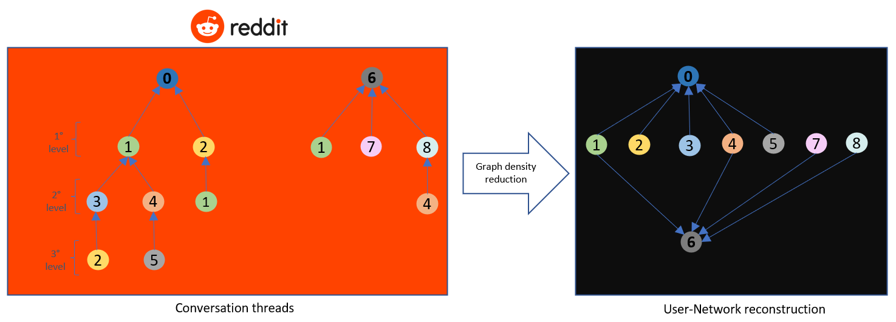

# A Social Media Alert System for Meme Stocks
Replication files for the paper: A Social Media Alert System for Meme Stocks.

*We plan to update the data and the model's results for 2024 soon, and to provide regular updates from 01-2025 onwards.*

This document explains how to reproduce results in the paper: A Social Media Alert System for Meme Stocks.

The model consists in an alert system designed to detect potential unusual activity in terms of user discussions on certain securities' tickers traded in the financial markets.

To achieve the results we extract network dimensions from the social network Reddit, and we convert them in potential signals to predict future abnormal returns. 

**Data decompression and processing**: 
decompression of the zst files containing the raw Reddit data. To download the data, we rely on the project built by https://github.com/Watchful1/PushshiftDumps. 
The data are in zst format: use the scipt decompress_zst.py to extract the raw data in a csv format, then use open.py to merge the comments and submissions.

**Training of the model**:
As explained in Section 5.2 of the paper, the alert system is trained on data up to 2022m5. The code train.py reproduces the training exercise with a grid-search algorithm.
